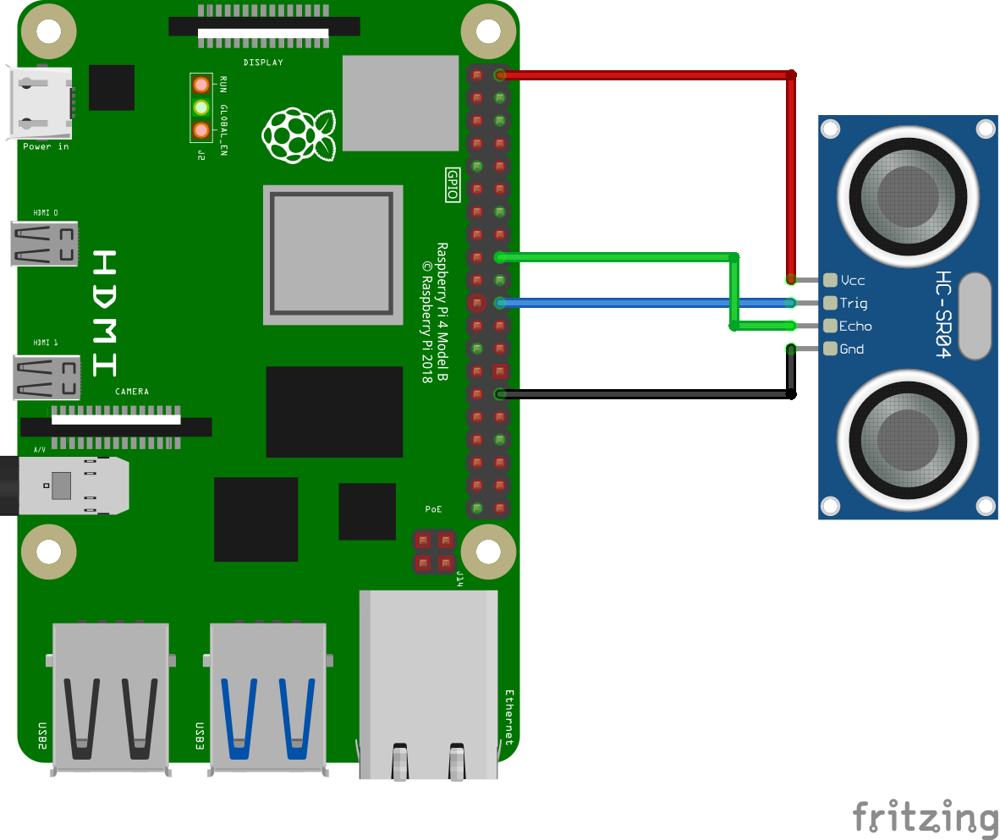

# HC-SR04: Ultrasonic Distance Sensor

## Requirements

The following libraries/extensions are required by this example:

* [ext-gpio](https://github.com/embedded-php/ext-gpio)

## Assembly

The wiring instructions below are required to run this example *without* modification.

HC-SR04 | Raspberry Pi | Reference
--------|--------------|----------
VCC     | Pin 02       | [5v Power](https://pinout.xyz/pinout/5v_power#)
Trigger | Pin 22       | [GPIO 25](https://pinout.xyz/pinout/pin22_gpio25#)
Echo    | Pin 18       | [GPIO 24](https://pinout.xyz/pinout/pin18_gpio24#)
GND     | Pin 30       | [Ground](https://pinout.xyz/pinout/ground#)

## Diagram

